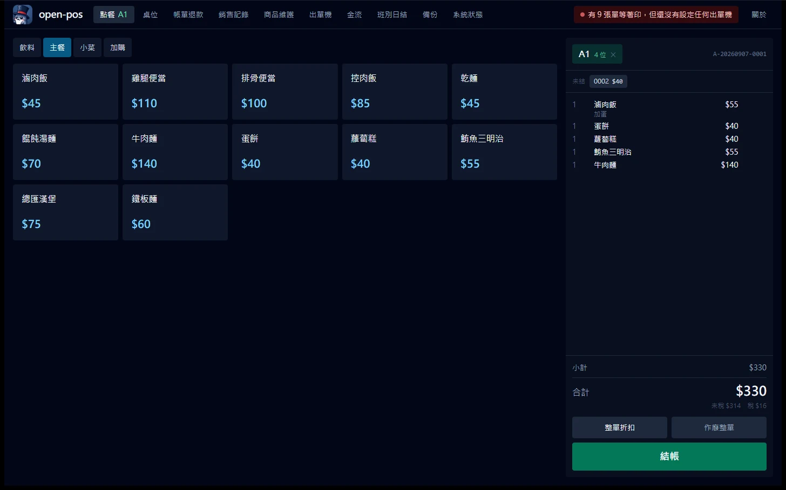
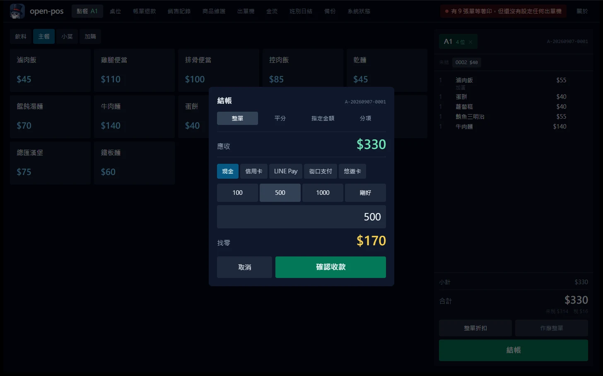
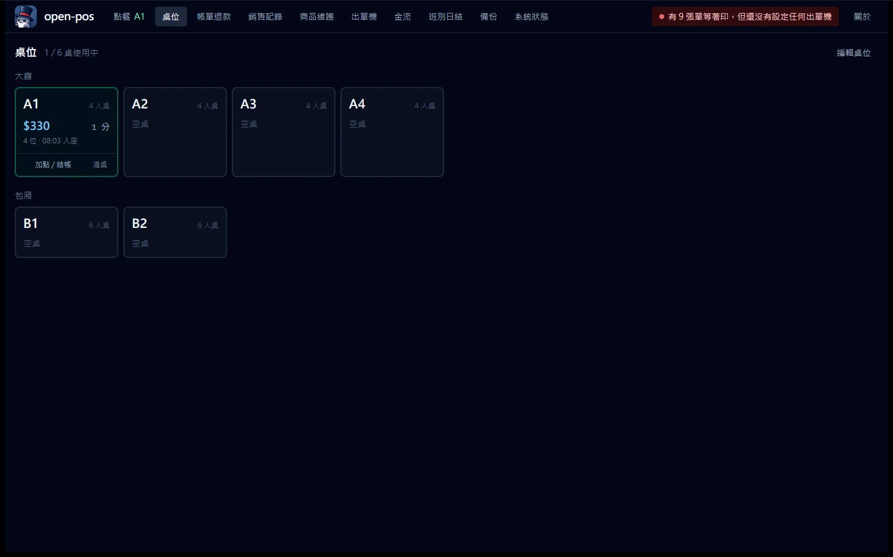
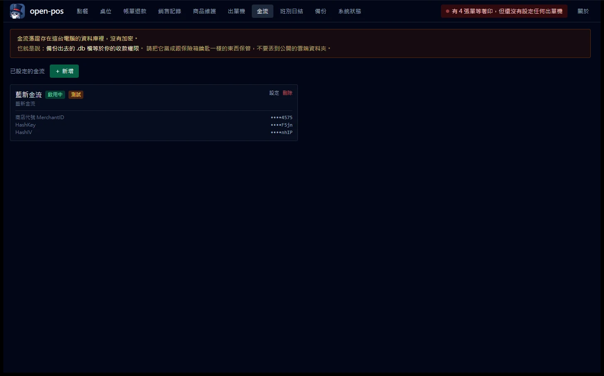

# open-pos

[繁體中文](README.md) · **English**

> An on-premise, open-source, free restaurant POS. One computer plus one receipt printer (出單機) and you can open for business.

Almost every POS sold to small and mid-sized restaurants in Taiwan is a closed system on a contract: a monthly fee, locked-in hardware, and no way to get your data back.
open-pos is meant to be the opposite: download one installer, zero monthly fee, your data on your own disk, all the source code open.

**Current status: v0.1.0, in development. The v1.0 feature set is complete, but there is no release build yet.
If you want to use it, build it from source yourself, and please do not run a real business on it yet.**

| Already working | Not done yet |
| --- | --- |
| Menu maintenance (categories / items / variants) | Installer and release process |
| Ordering, adding items, removing items, discounts, comps (招待, complimentary), voids | Report improvements and audit search (v1.2) |
| Table map (桌位圖): party size on open, per-table total and seated time, clearing a table | Customer QR self-ordering (掃碼點餐) (v1.3) |
| Checkout (mixed tender, change due, anti-fraud controls on post-checkout voids) | Taiwan uniform e-invoice (電子發票) (v1.4) |
| Split bills (分帳): even split / fixed amount / by item | PostgreSQL (v2.0) |
| Refunds (back to the original payment method, manager authorization, refund slip) | |
| Printing: network ESC/POS, station routing, queue with retry, receipt reprint | |
| Shift handover (班別交接) with blind count (盲盤), end-of-day close (日結) Z report, lockout after close | |
| Operations analytics (time-of-day distribution / discount stats / item rankings) | |
| Audit search (who moved how much money) | |
| KDS kitchen display (SSE push, disconnect detection, offline queue) | |
| Payment settings (LINE Pay, NewebPay (藍新金流), booking physical card-terminal payments by hand) | |
| Backup scheduling, external backup location, restore, diagnostics | |
| LAN connectivity diagnostics (network adapters, IP changes, firewall commands) | |

**If you are opening a shop, start here 👉 [Ten-Minute Setup Guide](docs/quickstart.md).**
What follows is for people who want to know why it is built this way.

A full day's workflow is complete now:
**open shift → open table → take orders → print tickets → check out (with split bill) → handover (blind count) → end-of-day close → backup.**
Connect one network ESC/POS printer, press 「測試列印」(Test Print) on the settings page, and if the slip that comes out is readable, you are ready to go.

The first launch is empty. There is a 「載入示範菜單與桌位」(Load demo menu and tables) button on the order page: see how it works first, then decide whether to build your own menu.

---

## What it looks like



The order screen. Menu on the left, cart on the right, so the cashier's motion
runs one way and never doubles back. Tiles are deliberately large, because at
peak hours people are standing and poking with one finger.



Checkout. The customer hands over 500 against 330 due, and the 170 change stays
on screen to be counted out. The row on top is the split-bill mode: whole bill /
even split / fixed amount / by item, matching what counter staff actually get asked.



The table map. Each card answers only three questions: is it free, how much is on
it, how long have they been sitting.



Payment settings. Credentials come back as the last four characters only, never
in plaintext; an incomplete set blocks the "enable" switch and the screen names
exactly which fields are still missing. The warning at the top is deliberately
the first thing you see.

---

## The three principles of this project

1. **It has to print, and it has to be correct.** A garbled ticket in the kitchen costs one remade dish plus one complaint.
   So Traditional Chinese defaults to bitmap printing (not relying on the printer's built-in font ROM), and we would rather be 1.5 seconds slower.
2. **Better a duplicate than a missing ticket.** If the kitchen gets two identical tickets, the cook notices from the order number;
   a ticket that never arrives is completely undetectable until the customer asks.
3. **It does not lose data.** Backups, a single-instance lock, and refusing to start on a network drive: these three have to be there in v1.0,
   not patched in after a user has lost a day of sales.

---

## Hardware requirements

| Item | Recommendation |
| --- | --- |
| Host machine | One Windows PC (a mini PC is fine). **It is also the server**, so do not shut it down |
| **UPS (uninterruptible power supply)** | **Strongly recommended.** A NT$1,000 UPS does more for availability than any single line of code in this project |
| Receipt/kitchen printer | Network ESC/POS (TCP 9100). USB and Bluetooth are on the roadmap |
| Network | Give the host a **static IP or a DHCP reservation** on the router, otherwise every table-card QR you printed goes dead the next time the router reboots |
| Backup | One USB stick left permanently plugged in |

---

## Development

Requires Rust 1.82+ and Node 22+.

```bash
npm install
npm run tauri dev          # register GUI (with built-in LAN server)

cd src-tauri
cargo test                 # full test suite, zero external dependencies (no Docker, no DATABASE_URL)
cargo clippy --all-targets -- -D warnings
cargo fmt --all
```

The first launch automatically creates a default store named 「我的店」(My Store), one register terminal,
26 permission codes and 5 system roles. After that you can build your menu on the 「商品維護」(Menu maintenance) tab.

> ⚠️ **There is no login screen yet (scheduled for M4).** The desktop app currently performs every action as the default 「店長」(Store Manager) account,
> and the audit log faithfully records it under that account. That is more honest than "the operator is NULL": once login is wired up,
> the audit data produced today still makes sense.

**Headless mode** (a host with no screen / Docker / serving only as the backend for the KDS and QR self-ordering):

```bash
cargo run --bin open-posd --no-default-features --features server
```

The binary this command produces links neither Tauri nor WebKit. CI verifies it: the moment someone accidentally lets
`core/` or `infra/` depend on tauri, that step goes red.

### You can contribute without a printer

`fakeprinter` simulates an ESC/POS printer on your own machine: the bytes it receives are decoded back into human-readable text by
**the same decoder that pairs with the encoder**, so what the simulator sees is what a real machine sees.

```bash
# start three at once, matching drinks bar / wok station / front counter
cargo run --bin fakeprinter --features dev-tools -- --port 9100,9101,9102

# simulate the ways real machines break
cargo run --bin fakeprinter --features dev-tools -- --simulate paper-out   # accepts the connection but never reads data
cargo run --bin fakeprinter --features dev-tools -- --simulate offline     # connects, then drops immediately
cargo run --bin fakeprinter --features dev-tools -- --simulate slow=200    # 200ms slower per KB
cargo run --bin fakeprinter --features dev-tools -- --simulate flaky=0.3   # 30% chance of dropping mid-print
```

Then add a network printer on the app's 「出單機」(Printers) page with address `127.0.0.1` and port `9100`.
Press 「測試列印」(Test Print) and the ticket shows up in the fakeprinter terminal.

**Want something to click on right away**: `--demo` builds a demo menu of 38 items.
It is idempotent: if any products already exist it skips entirely, so it will not pollute a menu you built yourself.

```bash
cargo run --bin open-posd --no-default-features --features server -- --demo
```

**Look at the LAN side**: the headless server serves the KDS and QR self-ordering pages,
so a tablet or phone on the same LAN can open `http://<your-LAN-IP>:8129/kds.html`.
The usable URLs are printed at startup.

The register page (`index.html`) is **deliberately not served over the LAN**: it exists for the Tauri window to load,
and nobody who merely joined the shop's Wi-Fi should be able to load the register UI. Its JS chunks are blocked too.

---

## Printers (出單機)

The most common hookup in Taiwanese food service is **network ESC/POS (TCP 9100)**, and it is the only one v1 implements.
It was not chosen because it is easy to connect, but because **it is the only connection that needs no driver**: vendor SDKs are often
a Windows DLL and nothing else, with no Linux driver at all, whereas 9100 is just one TCP connection carrying bytes, the same on any OS.

Configure it on the app's 「出單機」(Printers) page: enter the IP and port (almost always 9100) → test the connection → test print.
**If you can read the test print, the configuration is correct**; question marks or garbage usually mean the wrong Chinese encoding was selected.

### Three levels of indirection: item → station → printer

```
Bubble tea    ─┐
Green tea     ─┼─→ Drinks bar ─→ drinks-bar printer (primary) + counter printer (prints every time)
Winter melon  ─┘
Braised pork  ─┬─→ Wok station ─→ wok-station printer
Beef noodles  ─┘
```

Binding items straight to printers is the most common design mistake in a first POS: swap one machine or add a backup machine
and you have to edit hundreds of menu rows. 「飲料吧」(the drinks bar) is a stable concept; which machine sits under it is configuration.

A station can be set on the **item** or on the **category** (item wins), so adding 200 drinks does not mean setting it 200 times.
An item with no station prints at the counter marked 「代印」(printed on behalf of) instead of disappearing.

### What happens when it fails

* Backoff of 1 / 2 / 4 / 8 / 16 seconds, **capped at 30 seconds**: the kitchen is waiting for this ticket, and backing off to
  several minutes means that after the network recovers, that table waits several more minutes.
* A job goes to the dead letter queue on three conditions: a permanent error, 20 attempts used up, or **the ticket being older than 30 minutes**.
  Without the last one, a printer that was unreachable all evening spits out every ticket from last night in one burst the next morning.
* Failures light up a red dot in the top bar; click it to see the reason and reprint.
  The most common complaint against a POS is "the kitchen never got the ticket", and the root cause is nearly always that
  **the system knew the print failed and told nobody**.

### Before any printer is configured

The intent to print is kept, and the screen says 「有 N 張單等著印，但還沒有設定出單機」(N tickets are waiting to print, but no printer is configured yet).
Once a machine is connected and configured, those tickets flow out on their own (unless they are already older than 30 minutes).

---

## Tables and split bills

### Tables

The entire dine-in flow hangs off the table: an add-on order has to know which table it joins, a runner has to know where to carry the food,
and checkout has to total everything on that table. So a table is a first-class concept, not a string in a notes field.

Every card on the table map (桌位圖) answers only three questions: **is it free, how much is on it, how long have they been sitting**.
Color expresses only the last one: amber at ninety minutes, red at two hours. It is not there to rush customers,
it means "this table may have finished eating and not paid yet".

Two hard rules:

* **A table with an unsettled order cannot be cleared.** Otherwise 「清桌」(clear table) becomes a button that throws a bill away,
  and that is the easiest operation to abuse for pocketing a sale.
* **The table is released only after the last order is settled.** One table can carry many orders (separate checkouts, a second round,
  an add-on that opens a new order). Closing the table as soon as one is settled feels intuitive, but it strands the remaining
  unsettled orders on a closed session: gone from the table map, still owed. A bill you cannot see on the table map is money you will not collect.

### Split bills (分帳)

Three modes matching the three sentences you actually hear at the counter:

| Mode | The sentence |
| --- | --- |
| Even split | "The four of us are splitting it" |
| Fixed amount | "I'll put in 500, he covers the rest" |
| By item | "Mine is just that bowl of noodles" |

What gets split is the **bill**, not the order: the kitchen already cooked from that ticket, and not a single sold item changes.

**Σ of every share == the order total, strictly equal.** $150 split four ways is 38/38/37/37 (largest remainder method),
not four shares of 37 that leave $2 uncollected. Tax is split per bill rather than prorating the whole order's tax downward:
each bill is one invoice, and "net sales + tax = total" is a hard check by the Ministry of Finance (財政部, the tax authority).

The most expensive accident with split bills is **thinking it is fully collected**: three people each pay their own share,
the third one walks out and nobody notices. So while anything is still outstanding, "how much is still owed" appears on the receipt,
under the cart, and in the 「未結」(unsettled) row at the top of the order page (a takeaway order hangs off no table,
and without that row it really would be nowhere at all).

---

## Refunds

"One of the three drinks was made wrong" should not be handled with a post-checkout void: that wipes out the entire sale,
and it is the biggest fraud control point in food service. It should not get used every day.

A void (作廢) means "this transaction never happened". A refund (退款) means "it happened, then money went back".
So a refunded bill **still counts toward sales**, and refunds are their own column in the reports.

* **Back to the original method.** A refund always points at a specific payment. The UI only lets you pick which payment to refund,
  never how to refund it. Refunding a card payment in cash is the classic inside job:
  both sides balance on paper, the drawer is short, and the card charge is still there.
* **It counts toward today.** Refund yesterday's bill today and the money leaves the drawer today. Book it on the original bill's date
  and today's shift close is guaranteed to come up short, while yesterday's Z report gets altered after the fact.
* **A cash refund is deducted from expected cash.** Without this, every refund makes the shift close come up short,
  and the person counting the money cannot find the reason. After two or three of those, staff stop believing the count.
* It requires the `payment.refund` permission (which neither cashiers nor shift leads have by default), a mandatory reason,
  an approval record, and a printed refund slip for the customer to sign.

Finding a bill only needs **the last few digits of the order number**, and when a search string is given the lookup crosses days:
the customer has nothing but that receipt, and coming back with a three-day-old receipt is normal.

---

## Payments

**The right way to take credit cards with this POS is the physical card terminal your bank gave you.**

This is not laziness about integrating; integrating is simply not better. Every Taiwanese payment provider's API that lets you send
card numbers from inside your own program carries one rule with no exceptions in its application paperwork: anything that handles
cardholder data must hold a PCI DSS Attestation of Compliance (AOC). A Windows PC sitting on the counter, running the order database
and driving the kitchen printers at the same time, cannot get an AOC and should not be touching card numbers.

And the terminal the bank gave you is already a certified device. So the settings-page option called
「不串接（自己抄授權碼）」(no integration, copy the authorization code in yourself) is not a temporary stopgap.
**It is the recommended approach**: in the code it is a first-class implementation of `PaymentGateway`, and the end-of-day report still breaks it out.

| Payment method | How | Needs network |
| --- | --- | --- |
| Cash | Built in | ✗ |
| **Credit card (in store, face to face)** | **Run it on the physical terminal, then copy the authorization code into the POS** | ✗ |
| LINE Pay | Scan the payment code the customer shows on their phone | ✓ |
| NewebPay (藍新) MPG | The customer pays on their own phone (QR self-ordering, phone orders) | ✓ |

### The problem this layer actually solves

It is not "how do I call the API". It is **"the request went out, but the response never came back"**.

A declined card is not frightening: the cashier sees it right there and runs it again. What is frightening is the network dropping
after the request is sent and before the response arrives: the money has already been taken on the provider's side and the POS
knows nothing about it. The customer leaves, the shop finds out on next month's statement, and by then there is nobody left to find.

So `failed` and `unknown` are two different states:

| State | Meaning | What to do |
| --- | --- | --- |
| `failed` | Explicitly declined (insufficient funds, invalid card) | Safe to run it again |
| `unknown` | **Sent, but the outcome is unknown** | **Go reconcile. Do not treat it as if it never happened** |

Folding `unknown` into `failed` makes money disappear silently. **A retry keeps the same transaction number**:
the provider keys on the order number we sent them, so issuing a new one is an explicit request to charge again.

LINE Pay uses the **Offline API v4** rather than the online v3 for exactly one reason: v4's query endpoint takes our own order number,
so a "sent but no response received" case can still be looked up. v3 can only be queried by the transactionId it returns to us,
and that id sits in precisely the response we never received.

### Credentials

They are stored in the database, **unencrypted**. That sentence is printed on the settings page for the shop to read, because pretending
they are encrypted is more dangerous than saying it plainly: the shop would assume the backup file can be tossed into any cloud drive.

What is actually done is **reducing the places they appear**: the settings page can write them but not read them back (only the last four
characters are returned), the diagnostics bundle cannot touch that column, and the key type has a hand-written `Debug` that redacts,
so they do not show up in panic messages either.

**A `.db` you back up out of the machine is your ability to take payments.**

For the details, and for what is still missing on NewebPay MPG, see **[docs/payment-gateways.md](docs/payment-gateways.md)**.

---

## Shifts and end-of-day close

The day runs **open shift → trade → close shift (count the drawer) → end-of-day close (日結)**.

### Blind count (盲盤)

At shift close the screen **does not show expected cash**. Only after the cashier has counted the drawer by denomination
and entered the numbers does the system reveal the variance.

This is not idiot-proofing, it is fraud control: show the expected amount first and whoever is short simply copies it down,
which is exactly why cash variance is "always zero". Not that there is no problem: the problem is invisible.

The X report, which does show cash, sits behind the `report.daily` permission, which cashiers do not get by default.

### Snapshots, never recomputed

The numbers computed at the moment of shift close and end-of-day close are written straight into the database and never touched again.
Otherwise one backdated ticket entered the next day would change the numbers on a Z report from three months ago,
and a report that changes by itself has no standing in an audit.

Once the end-of-day close is done, that business date (營業日) is **locked**: opening orders, adding items, removing items,
and checking out are all refused. Without that lock, "end-of-day close" is just a meaningless timestamp.

Both the handover slip and the Z report are printed. At handover two people check the numbers against the same sheet of paper and sign it;
a handover record that exists only on a screen is worth nothing when there is a dispute afterwards.

---

## Backups

**On by default, running on their own.** A backup the user has to remember to press is the same as no backup.

* The schedule looks at "how long since the last backup" rather than "is it on the hour right now".
  On a register that is only powered on during business hours, an on-the-hour schedule silently misses an entire day.
* One backup at shift close and one at end-of-day close: those two moments are the end of a stretch of trading,
  and they are also the restore points you most want when restoring.
* **Please configure a second location** (a USB stick left permanently plugged in is enough).
  A backup on the same physical disk as the database only protects against accidental deletion, not against the disk failing.
  If the stick is not plugged in you only get a warning, and the local copy still completes.

### Restore

The restore button is on the same page. A system that has backups but nobody who knows how to restore them has no backups.

What to do when something goes wrong is written in **[docs/recovery.md](docs/recovery.md)**:
that page is written for the people in the shop, and printing it out and taping it next to the register is recommended.

Pressing it does not swap anything immediately: the database file is open while the program is running,
so a restore takes two steps. The backup is staged to a temporary location with a marker, and it is applied **on the next startup**.
The original data is renamed to `pre-restore.<timestamp>` and left in the folder, not deleted.
Restoring is something people do while panicking, so it must not be irreversible.

---

## Kitchen display (KDS)

A tablet on the same LAN opens `http://<register-IP>:8129/kds.html` and that is the kitchen screen.
Tapping an item once means "this one is ready", tapping again means "served" (state only moves forward, never back).

### The most important thing: a dropped connection has to be visible

The browser's `EventSource` has **no read timeout**. Cheap access points and tablet power saving silently cut idle connections,
and the browser never finds out. The symptom is "it looks connected but no tickets arrive".

This is the nastiest failure mode in the whole KDS: **silently dropped tickets**. The cook will not notice a dish they never made.
The customer will. So:

* The server sends a heartbeat every 16 seconds
* The tablet reconnects on its own after 45 seconds with no message of any kind (it does not rely on the browser's built-in reconnect)
* On disconnect a full-width red banner flashes at the top reading 「現在看到的單可能是舊的」(the tickets you are looking at may be stale)

### A 「完成」(done) tap made while offline does not disappear

If those taps simply vanished, the symptom would be "the screen shows a check mark and the register stays stuck on in-progress forever".
So anything that cannot be sent is written into the tablet's IndexedDB and replayed in the order it was tapped once the connection is back,
with a persistent banner reading 「N 個『完成』還沒送出去，連上就會補送」(N "done" taps have not been sent; they will go out when the connection returns).

Replay is safe because state **only moves forward**: the duplicate is quietly ignored.
Better to replay than to drop.

When the tablet reopens after being reclaimed by the OS, or when the AP happens to be rebooting, you still do not see the browser's error page:
the last board is stored locally, and the static files carry `stale-while-revalidate`,
so the page still opens when the host is unreachable (and clearly marks that what is on screen is stale).

### Why the push is a whole snapshot

At most 50 tickets are in progress at once, so the entire state is small. And a snapshot is **self-correcting**:
anything that changed during the outage is reflected directly in the first snapshot after reconnect.
Incremental replay lets errors accumulate permanently, and in a kitchen an accumulated error is a missing dish.

### Paper is the first source of truth

**The KDS is a secondary display.** When the host fails, the paper printer is the only thing still producing tickets.
A shop running KDS only, with no printer, has no safe degraded path when the host fails.
That sentence is written here rather than hidden.

---

## Day one of installation

"The tablet cannot reach the register" is the number one failure on installation day, and none of its three causes shows up in
any error message: the firewall dialog was dismissed with Cancel, the IP changed after the router rebooted,
or the host has several network adapters and the system picked the wrong one.

So **System status → LAN connectivity** lays out everything worth looking at:

* The URL the tablet should open (large type, copyable)
* **Every** network adapter, each annotated with why this one cannot be used (no address from DHCP, a WSL virtual adapter, and so on)
* The previous IP. If it differs from the current one it raises a warning and says outright that the table-card QR codes have to be reprinted
* The firewall command, to copy and run as Administrator

★ This page **will not print a fake green light**. Connecting to your own LAN IP from the same machine only proves the server
is bound to the right adapter; it proves nothing about the firewall (Windows mostly short-circuits a connection to itself inside the kernel).
The only thing that proves anything is another device actually being able to open it, and that is what the screen says.

open-pos also will not quietly elevate itself to change your firewall settings. You get the command; you run it.

---

## Architecture

```
3 frontend entries ── src/shared/api.ts (the only bridge layer)
     ┌──────────┴──────────┐
Tauri commands      axum POST /api/rpc/{name}
     └──────────┬──────────┘
          services/     ← the only entry point for both transports
        ┌───────┴───────┐
      core/           infra/
```

* `core/` is pure business logic: zero I/O, zero async, zero SQL. Pricing, state machines and business-date conversion all live here,
  so hundreds of thousands of tests run on fake data in microseconds.
* The transaction boundary is in `services/` (one `UnitOfWork` per use case), not inside repository methods:
  otherwise a single checkout touching four tables cannot be made atomic.
* **No external I/O of any kind inside a transaction** (printer TCP, file drops, HTTP). The write pool has exactly one connection,
  so one slow transaction queues up every write in the shop. Anything needing external I/O is written to an outbox and retried by a background worker.

**The API has exactly one shape**: `POST /api/rpc/{name}`, where `{name}` maps one-to-one to a Tauri command name.
That is why the frontend's `src/shared/api.ts` only needs to exist once: the two transport implementations differ by one line each.
On success it returns the JSON of `T` directly (no envelope); on failure a non-2xx status plus `{"error": AppError}`,
matching the shape of `invoke`'s resolve / reject.

**Permission boundary**: menu maintenance, reports, printer settings and shift close **do not exist** on the LAN server; they go through Tauri IPC only.
The read-only menu tree (`menu_tree`) is the exception, because the KDS and customer phones need it.
So even if the LAN service has a hole, the attack surface stops at "send junk orders". It does not reach "see the sales figures / change prices".

Stack: Tauri 2 + Rust + sqlx (SQLite) + React 18 + Vite 5 + Tailwind 3.
The architecture follows the same author's [db-kit](https://github.com/markku636/db-kit).

Design decisions are recorded in [`docs/adr/`](docs/adr/):
[money as integer dollars](docs/adr/0001-money-as-integer-dollars.md),
[time and business date](docs/adr/0002-time-and-business-date.md),
[single-source DDL](docs/adr/0003-single-source-ddl.md).

---

## Roadmap

| Version | Contents |
| --- | --- |
| **v1.0** | Ordering + tables + checkout (including split bills and refunds) + printing + shifts and end-of-day close + backups (feature-complete; still missing the installer and release process) |
| ~~v1.1~~ | ~~KDS kitchen display~~ (done, pulled forward into v1.0) |
| v1.2 | Report improvements, audit search, offline KDS queue and device pairing |
| v1.3 | Customer QR self-ordering |
| v1.4 | Taiwan uniform e-invoice (self-hosted Turnkey) |
| v2.0 | PostgreSQL backend |

v1.0 deliberately leaves out KDS, QR self-ordering and e-invoicing. Not because they could not be finished, but because the critical path
for those three is not in the maintainer's hands (e-invoicing is blocked on each shop applying for its own certificate and static IP,
QR self-ordering is blocked on the customer's phone browser, KDS is blocked on cheap tablets and cheap access points).
Get "one computer and one printer is enough to open" solidly usable first.

---

## Known limitations (read all of this before you adopt it)

* **Single-machine architecture.** All data lives in one SQLite file on the host; the KDS and customer phones are pure display plus command sending.
  Recovery from a host failure is "plug in the USB backup, press restore on a second machine, take over",
  with an RTO of about 10 minutes and an RPO equal to the last backup. **There is no automatic failover, and none is planned.**
* **The database must not sit on a network drive or in a cloud-sync folder.** The program refuses to start and tells you the correct approach.
  This is not conservatism: SQLite's WAL **silently corrupts data** in both of those environments.
* **The paper kitchen printer is the first source of truth; the KDS is a secondary display.**
  A shop running KDS only, with no printer, has no safe degraded path when the host fails.
* The LAN runs HTTP, not HTTPS. Scanning a QR that opens a private IP raises no warning, but the browser's
  Service Worker, Screen Wake Lock and Notification APIs are all unavailable,
  so set KDS tablets to never sleep and keep them plugged in.

---

## Non-goals

* Cloud multi-store sync, loyalty points
* **Never handling credit card numbers** (staying out of PCI scope). Cards go through the physical terminal the bank gave you,
  and the POS records only the authorization code. See [docs/payment-gateways.md](docs/payment-gateways.md)
* Free customization work; hardware support depends on community PRs and hardware compatibility reports
* Any promise of a response time

The software is provided as is under the MIT license. **Users of the e-invoice module are responsible for their own reconciliation and their own legal compliance.**

---

## License

[MIT](LICENSE)
