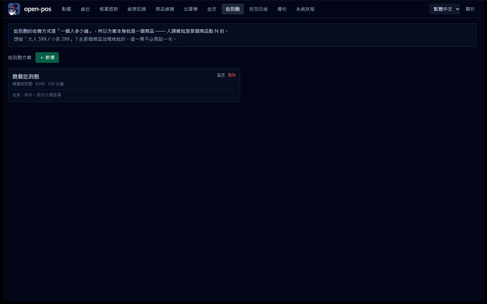
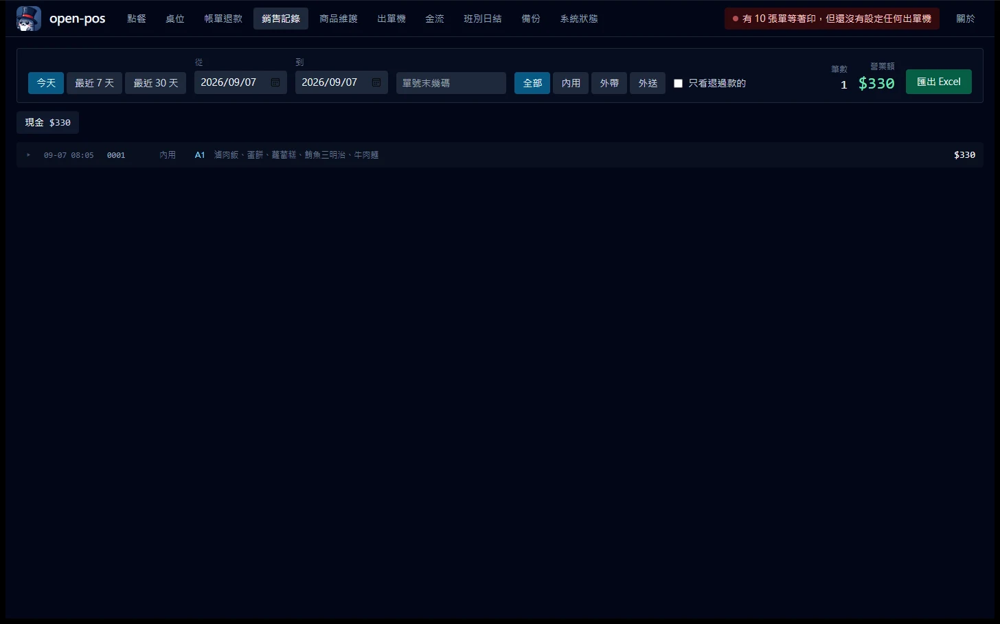

# open-pos

**繁體中文** · [English](README.en.md)

> 地端、開源、免費的餐飲 POS 點餐系統。一台電腦 + 一台出單機就能開店。

> ☕ 這個工具免費且開源。如果幫上忙，可以 [請我喝杯咖啡](#贊助開源)。

台灣中小餐飲的 POS 幾乎都是綁約的封閉系統：月租費、硬體綁定、資料拿不回來。
open-pos 想做的是相反的東西 —— 下載一個安裝檔、零月租、資料在自己的硬碟上、程式碼全開源。

---

## 白話版：這是什麼？

**一套裝在自己店裡電腦上的點餐收銀系統。**

| 你可能會問 | 答案 |
| --- | --- |
| 要錢嗎？ | 不要。沒有月租、沒有試用期、沒有「進階版」。 |
| 網路斷了還能用嗎？ | **可以。** 它整套跑在店裡那台電腦上，不靠雲端。 |
| 我的營業資料在誰手上？ | 你自己的硬碟。我們看不到，也沒有地方可以看。 |
| 需要買特別的機器嗎？ | 一台普通 Windows 電腦，加一台網路型出單機（幾千元）。 |
| 不會用電腦可以嗎？ | 點餐、結帳、收班是點按鈕。**裝機那一次**建議找懂電腦的人幫忙。 |
| 壞掉了誰負責？ | 沒有客服。這是開源專案，出問題請開 issue —— 這點先說清楚比較好。 |

### 它幫你做這些事

* **點餐**：左邊菜單、右邊帳單，點一點就好。可以加點、退點、打折、招待。
* **桌位**：哪桌有人、坐多久、目前多少錢，一眼看完。
* **結帳**：現金找零自動算，也能刷卡、LINE Pay。**幾個人分開付也行。**
* **出單**：廚房、飲料吧各印各的。印不出來會在螢幕上叫你，不會默默漏單。
* **交班**：數完抽屜裡的錢再輸入，系統才告訴你差多少 —— 先看到答案就沒有意義了。
* **日結**：每天的營業額、付款方式、熱賣品項，存成當天的紀錄，之後不會再變。
* **備份**：自己每小時做一次。插一支隨身碟，它會多存一份到那裡。

### 開始要做什麼

1. 下載安裝檔，裝起來（跟裝一般軟體一樣）
2. 打開後按「載入示範菜單」，先玩玩看
3. 覺得可以用，再把自己的菜單建進去
4. 接上出單機，按「測試列印」—— **那張紙看得懂，就設定好了**

詳細步驟在 👉 **[十分鐘開店指南](docs/quickstart.md)**

### 三件要先知道的事

* **現在還在開發中。** 功能都做好了，但還沒正式發行 ——
  真的要拿去做生意，請先自己空跑一天看看。
* **請買一台不斷電系統（UPS）。** 一千多元，比這個專案裡任何一行程式碼
  都更能避免你掉資料。
* **資料只在那一台電腦上。** 所以備份不是選配。插著一支隨身碟就好，
  它會自己處理。

---

**目前狀態：v0.1.0 開發中。v1.0 的功能已經齊了，但還沒有發行版 ——
要用請先自己從原始碼建置，並且請先不要拿它去真的做生意。**

| 已經可用 | 還沒做 |
| --- | --- |
| 商品維護（分類 / 品項 / 規格） | 安裝檔與發行流程 |
| 點餐、加點、退點、折扣、招待、作廢 | 報表強化與稽核查詢（v1.2） |
| 桌位圖：開檯人數、每桌金額與入座時間、清桌 | 顧客掃碼點餐（v1.3） |
| 結帳（混合支付、找零、結帳後作廢防弊） | 台灣電子發票（v1.4） |
| 分帳（平分 / 指定金額 / 分項） | PostgreSQL（v2.0） |
| 退款（原路退回、主管授權、退款單） | |
| 出單：網路型 ESC/POS、分區路由、佇列重試、補印收據 | |
| 班別交接（盲盤）、日結 Z 報表、日結後鎖定 | |
| 營運分析（時段分布 / 折扣統計 / 品項排行） | |
| 稽核查詢（誰動了多少錢） | |
| KDS 廚房顯示（SSE 推播、斷線偵測、離線佇列） | |
| 金流設定（LINE Pay、藍新、實體刷卡機記帳） | |
| 備份排程、外接備份位置、還原、診斷資訊 | |
| 區網連線診斷（網卡、IP 變動、防火牆指令） | |

**要開店的人請從 👉 [十分鐘開店指南](docs/quickstart.md) 開始。**
下面這一份是給想知道「為什麼這樣做」的人看的。

一整天的流程現在是完整的：
**開班 → 開檯 → 點餐 → 出單 → 結帳（可分帳）→ 交接（盲盤）→ 日結 → 備份。**
接上一台網路型 ESC/POS，在設定頁按「測試列印」看得懂那張紙，就可以開始了。

第一次打開是空的，點餐頁上有一顆「載入示範菜單與桌位」——
先看看它怎麼運作，再決定要不要自己建菜單。

---

## 贊助開源

這個工具免費且開源。如果它幫你省下了時間，可以請我喝杯咖啡，讓後續的更新繼續做下去。

[](https://www.paypal.com/ncp/payment/8B7GRXA6UJH36)
[](https://www.paypal.com/ncp/payment/8LBTFUBBF2CHS)
[](https://www.paypal.com/ncp/payment/A653DD46GEU4W)
[](https://www.paypal.com/ncp/payment/Y5WPSXVGH3YS4)

其他金額請走 [PayPal.Me](https://paypal.me/226network)。

## 長什麼樣子


點餐畫面。左菜單右購物車，收銀員的動線一路往右不用回頭 ——
品項磚刻意做大，因為尖峰時間是站著用食指戳的。


結帳。客人給 500、應收 330，找零 170 算出來之後停在畫面上讓人照著數。
上面那排是分帳模式 —— 整單 / 平分 / 指定金額 / 分項，對應櫃檯真的會聽到的那幾句話。


桌位圖。每張卡片只回答三個問題：空不空、多少錢、坐多久了。


金流設定。憑證只回末四碼，永遠不回明文；沒填完的欄位會擋住「啟用」，
並直接說出還缺哪幾個。最上面那段警語是刻意放在第一眼的位置的。

---

## 這個專案的三個原則

1. **一定要印得出來，而且要對。** 廚房收到亂碼的單，代價是一份重做的餐加一個客訴。
   所以繁體中文預設走點陣圖列印（不依賴印表機內建字庫），寧可慢 1.5 秒。
2. **寧可重複，不可漏印。** 廚房收到兩張一樣的單，廚師看訂單號會發現；
   收不到單則完全無法察覺，直到客人來問。
3. **不會掉資料。** 備份、單實例鎖、拒絕在網路磁碟上啟動 —— 這三件事在 v1.0 就要有，
   而不是等使用者掉了一天的營業額才補。

---

## 硬體需求

| 項目 | 建議 |
| --- | --- |
| 主機 | 一台 Windows 電腦（迷你主機即可）。**它同時是伺服器**，請不要關機 |
| **UPS 不斷電系統** | **強烈建議。** 一千元的 UPS 比這個專案裡任何一行程式碼都更能提升可用性 |
| 出單機 | 網路型 ESC/POS（TCP 9100）。USB 與藍牙在路線圖上 |
| 網路 | 主機請在路由器設**固定 IP 或 DHCP 保留**，否則印好的桌卡 QR 會在路由器重開後全部失效 |
| 備份 | 一支常插著的 USB 隨身碟 |

---

## 開發

需要 Rust 1.82+ 與 Node 22+。

```bash
npm install
npm run tauri dev          # 收銀機 GUI（含內建 LAN server）

cd src-tauri
cargo test                 # 全部測試，零外部相依（不需要 Docker、不需要 DATABASE_URL）
cargo clippy --all-targets -- -D warnings
cargo fmt --all
```

第一次啟動會自動建立一間名為「我的店」的預設店家、一台收銀機終端、
26 個權限碼與 5 個系統角色，然後就可以在「商品維護」分頁建菜單了。

> ⚠️ **登入畫面還沒做（排在 M4）。** 桌面版目前以預設的「店長」帳號執行所有操作，
> 稽核紀錄會如實記在它頭上。這比「操作者是 NULL」誠實 —— 等登入接上之後，
> 現在產生的稽核資料仍然解釋得通。

**headless 模式**（無螢幕主機 / Docker / 只當 KDS 與掃碼點餐的後端）：

```bash
cargo run --bin open-posd --no-default-features --features server
```

這條指令編出來的執行檔完全不連 Tauri 與 WebKit。CI 會驗證它 —— 只要有人不小心讓
`core/` 或 `infra/` 依賴到 tauri，那一步就會紅。

### 沒有出單機也能貢獻

`fakeprinter` 在本機模擬一台 ESC/POS 印表機：收到的位元組會用**與編碼器同一份
解碼器**解回人類看得懂的文字，所以模擬器看到的就是真機會看到的。

```bash
# 一次起三台，對應飲料吧 / 熱炒區 / 櫃檯
cargo run --bin fakeprinter --features dev-tools -- --port 9100,9101,9102

# 模擬真機的壞法
cargo run --bin fakeprinter --features dev-tools -- --simulate paper-out   # 收下連線但不讀資料
cargo run --bin fakeprinter --features dev-tools -- --simulate offline     # 接了就斷
cargo run --bin fakeprinter --features dev-tools -- --simulate slow=200    # 每 KB 慢 200ms
cargo run --bin fakeprinter --features dev-tools -- --simulate flaky=0.3   # 三成機率印到一半斷線
```

然後在 App 的「出單機」頁新增一台網路印表機，位址填 `127.0.0.1`、連接埠 `9100`，
按「測試列印」就會在 fakeprinter 的終端機看到那張單。

**想直接有東西可以按**：`--demo` 會建一份 38 個品項的示範菜單。
它是冪等的，已經有商品就整個跳過，不會汙染你自己建的菜單。

```bash
cargo run --bin open-posd --no-default-features --features server -- --demo
```

**看看區網那一側**：headless server 會把 KDS 與掃碼點餐頁服務出去，
同區網的平板 / 手機可以開 `http://<你的區網IP>:8129/kds.html`。
啟動時會把可用的網址印出來。

收銀機那一頁（`index.html`）**刻意不從區網服務** —— 它是給 Tauri 視窗載入的，
而且任何連上店內 Wi-Fi 的人都不該能載入收銀介面。連它的 JS chunk 也一起擋掉。

---

## 出單機

台灣餐飲最常見的接法是**網路型 ESC/POS（TCP 9100）**，也是 v1 唯一實作的。
選它不是因為好接，而是因為**它是唯一不需要驅動程式的接法** —— 廠商 SDK 常常只有
Windows DLL，Linux 根本沒有驅動；而 9100 就是一條 TCP 連線送位元組，任何 OS 都一樣。

設定在 App 的「出單機」頁：填 IP 與連接埠（幾乎都是 9100）→ 測試連線 → 測試列印。
**測試列印那張紙看得懂，就代表設定正確**；印出問號或亂碼通常是中文編碼選錯了。

### 三層間接：品項 → 分區 → 印表機

```
珍珠奶茶 ─┐
四季青茶 ─┼─→ 飲料吧 ─→ 飲料吧那台（主要）＋ 櫃檯那台（每次都印）
冬瓜檸檬 ─┘
滷肉飯   ─┬─→ 熱炒區 ─→ 熱炒區那台
牛肉麵   ─┘
```

把品項直接綁印表機是新手 POS 最常見的設計錯誤：換一台機器、加一台備援機，
就要去改幾百筆菜單。「飲料吧」是一個穩定的概念，底下綁哪台機器是設定。

分區可以設在**品項**或**分類**上（品項優先），所以新增 200 個飲料不必設 200 次。
沒設分區的品項會印到櫃檯並標成「代印」而不是消失。

### 失敗了會怎樣

* 退避 1 / 2 / 4 / 8 / 16 秒，**封頂 30 秒** —— 廚房在等這張單，退避到幾分鐘
  等於在網路恢復之後又讓那一桌多等幾分鐘。
* 死信有三個條件：永久錯誤、試滿 20 次、**這張單超過 30 分鐘**。
  少了最後一條，一台整晚不通的機器會在隔天早上一次吐出昨晚所有的單。
* 失敗會亮在頂欄的紅點上，點進去可以看原因並補印。
  POS 最常見的客訴是「廚房沒收到單」，而根因幾乎都是
  **系統知道印失敗了，但沒有告訴任何人**。

### 還沒設定印表機的時候

出單的意圖會留著，畫面會說「有 N 張單等著印，但還沒有設定出單機」。
接上機器並設定完成之後，那些單會自己流出去（除非已經超過 30 分鐘）。

---

## 吃到飽 / 單點 / 飲料店



**吃到飽的收費方式是「一個人多少錢」，所以方案本身就是一個商品** ——
人頭費就是那個商品點 N 份。

這不是我想出來的，是查了 25 套市售產品之後的共識：Airレジ 的「放題プラン名商品」、
スマレジ 的『プラン』、Eats365 的 representing item，做法都一樣。

這樣做免費得到四件事：

* **大人 / 小孩不同價** → 那個商品的兩個規格，不必再設一套人頭分級
* **平日 / 假日不同價** → 既有的價格規則
* **稅額、分帳、收據、報表** → 全部自動適用，定價引擎一行都沒改

最後一項是關鍵。定價引擎把稅攤到**每一行**並保證「Σ 每行 = 總額」
（發票的品項加總要對得上總計，差一元整批退件）。人頭費既然是一行，
就自動走完整條路。做成訂單上的一個欄位的話，那四件事每一件都要重寫。

### 點下去就生效，不必先切換模式

點「晚餐吃到飽 ×4」，這一桌就變成吃到飽 —— 沒有另外一個「切換成吃到飽」的按鈕。

Airレジ 也是這樣做的，而它防的是一種很貴的失誤：**店員忘了切換模式，
飲料全部照原價收**，然後在客人面前發現金額不對。

方案內的品項變 0 元但**仍然留在單上** —— 廚房要知道要泡兩杯。
不在方案裡的照常收錢，那就是加價品（和牛 +200、酒水另計）。

### 用餐時限只提醒，不加價也不擋單

查過的 25 套產品裡**沒有一套**會在時間到的時候自動加價。Square 與 Clover 只變顏色、
スマレジ 推播到手持機、Eats365 顯示 OT。所以這裡也只提醒。

這件事寫在設定畫面上，因為老闆很容易以為設了時限就會自動收超時費 ——
而那個誤會要等到客人坐了三小時、帳單上什麼都沒有的時候才會發現。

### 刻意不做的兩件事

* **店家層級的「營業型態」開關。** 市場上幾乎沒有產品這樣做，而且它做不出
  「同桌不同價」—— 一桌可以大人吃到飽、小孩單點兒童餐。
  「午餐吃到飽、晚餐單點」用時段規則解決，那個本來就有了。
* **低消自動補差額。** 日本五套 POS 全部沒有低消；唯一打出低消的
  台灣 WETOM 是「提醒」而不是自動補一行。所以這裡也只做提醒。

完整的市場調查與被推翻的設計，見 **[docs/dining-modes.md](docs/dining-modes.md)**。

---

## 桌位與分帳

### 桌位

內用的整條動線都掛在桌上：加點要知道加到哪一桌、送餐要知道端去哪裡、
結帳要把那一桌的東西一起算。所以桌是一級概念，不是備註欄裡的一個字串。

桌位圖上每張卡片只回答三個問題：**空不空、多少錢、坐多久了**。
顏色只表達最後一個 —— 九十分鐘轉琥珀、兩小時轉紅。不是催客人，
是「這一桌可能已經吃完但還沒結帳」。

兩條硬規則：

* **有未結帳的單不能清桌。** 否則「清桌」會變成一個把帳丟掉的按鈕，
  而那是最容易被拿來吃單的操作。
* **結完最後一張單才釋放桌位。** 一桌可以有很多張單（分開結帳、續攤、
  加點開新單）。結一張就關檯很直覺，但它會把剩下沒結的單留在一個已關的
  session 上：從桌位圖上消失，帳卻還在。桌位圖上看不到的帳等於收不到的錢。

### 分帳

三個模式對應櫃檯真的會聽到的三句話：

| 模式 | 那句話 |
| --- | --- |
| 平分 | 「我們四個平分」 |
| 指定金額 | 「我先出 500，剩下他付」 |
| 分項 | 「我的只有那碗麵」 |

拆的是**帳單**不是訂單 —— 廚房已經照那張單做菜了，賣出去的東西一件都沒變。

**Σ 每一份 == 訂單總額，嚴格相等。** $150 分四份是 38/38/37/37（最大餘數法），
不是四個 37 少收 2 元。稅是每張帳單自己拆的，不是把整單稅額分攤下去 ——
每張帳單就是一張發票，而「銷售額＋稅額＝總額」是財政部的硬檢核。

分帳最貴的意外是**以為收完了**：三個人各付各的，第三個人走掉而沒有人發現。
所以還沒收完的時候，「還差多少」會出現在收據上、購物車底下、
以及點餐頁上方那一列「未結」單裡（外帶的單不掛在任何桌上，
少了那一列它就真的不在任何地方了）。

---

## 退款

「三杯飲料有一杯做錯了」不該用「結帳後作廢」處理 —— 那會把整筆銷售抹掉，
而且那是餐飲業最大的防弊點，不該天天被用到。

作廢＝「這筆交易沒有發生過」，退款＝「發生過，然後退回來」。
所以退過款的帳單**仍然算在營業額裡**，退款在報表上是獨立的一欄。

* **原路退回。** 一筆退款一定指向一筆收款，介面上只能選「退哪一筆」，
  不能選「用什麼方式退」。刷卡收的錢用現金退是最經典的一種內神通外鬼：
  帳面上兩邊都平，抽屜裡少了錢而信用卡那筆還在。
* **算在今天。** 昨天的帳單今天退，錢是今天離開抽屜的。記在原帳單那天的話，
  今天關班一定短少，而昨天的 Z 報表會在事後被改動。
* **現金退款從「應有現金」扣掉。** 少了這一條，每退一次款關班就短少一次，
  而數錢的人找不出原因 —— 這種經驗發生兩三次，店員就不再相信盤點結果。
* 需要 `payment.refund` 權限（收銀員與領班預設都沒有）、必選原因、
  留簽核紀錄，並印一張要客人簽名的退款單。

找帳單用**單號末幾碼**就好，而且有搜尋字串時會跨日找 ——
客人手上只有那張收據，而拿著三天前的收據回來是常態。

---

## 金流

**這套 POS 收信用卡的正解，是銀行給你的那台實體刷卡機。**

不是懶得串，是串了也沒有比較好。所有台灣金流商能讓你在自己的程式裡直接送
卡號的那支 API，申請文件上都有一條沒有例外的規定：經手持卡人資料就必須具備
PCI DSS 的合規聲明文件（AOC）。一台放在櫃檯、同時在跑訂單資料庫與廚房出單機的
Windows 電腦拿不到 AOC，也不應該碰到卡號。

而那台銀行給的刷卡機本來就是通過認證的裝置。所以設定頁上那個叫
「不串接（自己抄授權碼）」的選項不是暫時的過渡狀態，**它是被推薦的做法**——
它在程式裡是 `PaymentGateway` 的一個正式實作，日結報表照樣分得出來。

| 收款方式 | 做法 | 需要網路 |
| --- | --- | --- |
| 現金 | 內建 | ✗ |
| **信用卡（店內面對面）** | **實體刷卡機刷完，把授權碼抄進 POS** | ✗ |
| LINE Pay | 掃客人手機出示的付款碼 | ✓ |
| 藍新 MPG | 客人用自己的手機付（掃碼點餐、電話預訂） | ✓ |

### 這一層真正要解的問題

不是「怎麼呼叫 API」，是**「請求送出去了，但回應沒收到」**。

刷卡失敗不可怕 —— 收銀員當場看得到，重刷一次就好。可怕的是網路在送出之後、
回應之前斷掉：錢在金流商那邊已經扣了，POS 這邊什麼都不知道。客人走了，
店家要到隔月對帳單才發現，那時已經找不到人。

所以 `failed` 與 `unknown` 是兩個狀態：

| 狀態 | 意思 | 該做什麼 |
| --- | --- | --- |
| `failed` | 明確被拒（餘額不足、卡片無效） | 可以放心重刷 |
| `unknown` | **送出去了，但不知道結果** | **去對帳。不可以當成沒發生** |

把 `unknown` 併進 `failed` 會讓錢無聲地消失。**重試時交易編號不換** ——
金流商認的是我方送過去的訂單號，換一個新的等於明確要求對方再扣一次。

LINE Pay 選的是 **Offline API v4** 而不是線上版 v3，理由只有一個：v4 的查詢
端點吃的是我方訂單號，所以「送出去但沒收到回應」時查得到。v3 只能用它回給
我們的 transactionId 查 —— 而那個 id 正好就在我們沒收到的那個回應裡。

### 憑證

存在資料庫裡，**沒有加密**。這句話直接印在設定頁上給店家看，因為假裝它被
加密了比誠實地說出來更危險 —— 店家會以為備份檔可以隨便丟雲端。

真正做到的是**減少它出現的地方**：設定頁存得進去但讀不回來（只回末四碼）、
診斷包碰不到那一欄、金鑰型別手寫了會遮蔽的 `Debug` 所以 panic 訊息裡也不會有。

**備份出去的 `.db` 等於你的收款權限。**

細節與藍新 MPG 還缺什麼，見 **[docs/payment-gateways.md](docs/payment-gateways.md)**。

---

## 銷售記錄與報表



翻帳這件事每天都在發生：客人拿著三天前的收據回來問，或是老闆想知道昨天
中午賣了什麼。所以查詢條件是「日期區間 + 通路 + 單號末幾碼」——
**末幾碼**是因為客人手上只有那張收據，而沒有人會把 26 碼的單號念完。

**這一頁的搜尋不跨日**，日期區間永遠有效。跟「帳單退款」那一頁刻意不同 ——
這裡上方有「筆數 / 營業額」的合計，一個會忽略日期區間的搜尋會讓那個數字
變成「全部歷史」，而畫面上的日期選擇器還顯示著今天。退款那一頁沒有合計，
所以在那裡跨日找是安全的。

要翻更久以前的單，把日期區間拉開就好。

右上角的「匯出 Excel」出的是**真的數字**，不是文字 —— 金額欄位在 Excel 裡
可以直接加總、可以排序。用文字存金額的報表，會在 `'9' > '10'` 的字典序上
安靜地排錯。

日結報表另外有一頁（班別日結 → 日報表），出的是日結當下算好的那份快照。

---

## 班別與日結

一天的流程是 **開班 → 營業 → 關班（盤點）→ 日結**。

### 盲盤

關班時**畫面上不顯示應有現金**。收銀員照面額把抽屜裡的錢數一遍、輸入之後，
系統才揭曉差異。

這不是防呆，是防弊：先把應有金額顯示出來，短少的人會直接照抄 ——
而那正是「現金差異永遠是零」的原因。不是沒有問題，是看不到問題。

會顯示現金的 X 報表掛在 `report.daily` 權限下，收銀員預設拿不到。

### 快照，永不重算

關班與日結當下算好的數字直接寫進資料庫，之後不再動。
否則隔天補一張單，三個月前的 Z 報表數字就會跟著變 ——
而一份會自己變的報表在稽核上完全站不住。

日結完成之後那個營業日就**鎖住**了：開單、加點、退點、結帳全部拒絕寫入。
少了這道鎖，「日結」只是一個沒有意義的時間戳。

交接單與 Z 報表都會印出來。交班時兩個人要在同一張紙上對數字、簽名；
只存在螢幕上的交接紀錄，在事後爭議時沒有任何用處。

---

## 備份

**預設開啟，自己跑。** 一個要使用者自己記得去按的備份，等於沒有備份。

* 排程看的是「**距離上次備份多久**」而不是「現在是不是整點」。
  一台只在營業時間開著的收銀機，整點排程會安靜地漏掉一整天。
* 關班與日結時各備一次 —— 那兩個時間點是「一段營業的結束」，
  也是還原時最想要的還原點。
* **請設定第二個位置**（一支常插著的 USB 隨身碟就夠了）。
  跟資料庫放在同一顆硬碟上的備份只防「誤刪」，不防「硬碟壞掉」。
  隨身碟沒插只是警告，本機那一份照樣完成。

### 還原

還原按鈕就在同一頁。一個「有備份但沒有人知道怎麼還原」的系統等於沒有備份。

出事的時候該怎麼做，寫在 **[docs/recovery.md](docs/recovery.md)** ——
那一頁是給店裡的人看的，建議印出來貼在收銀機旁邊。

按下去之後不會馬上替換 —— 資料庫檔案在程式跑的時候是開著的，
所以還原分兩步：先把備份放到暫存位置並留下標記，**下次啟動時**套用。
原本的資料會改名成 `pre-restore.<時間>` 留在資料夾裡，不會刪除。
還原是人在慌張的時候做的事，不能是不可逆的。

---

## 廚房顯示（KDS）

同區網的平板開 `http://<收銀機的IP>:8129/kds.html` 就是廚房畫面。
點一下品項＝「這一項好了」，再點一次＝「出餐了」（只能往前推，不能往回）。

### 最重要的一件事：斷線要看得見

瀏覽器的 `EventSource` **沒有 read timeout**。爛 AP 與平板省電會靜默切斷
閒置連線，而瀏覽器不會知道 —— 症狀是「看起來還連著但收不到單」。

這是整個 KDS 最惡劣的失敗模式：**無聲的漏單**。廚師不會發現自己少做了
一份餐，客人會。所以：

* 伺服器每 16 秒送一次心跳
* 平板 45 秒沒收到任何訊息就自己重連（不依賴瀏覽器的內建重連）
* 斷線時整條紅色橫幅在最上面閃，寫著「現在看到的單可能是舊的」

### 斷線時按的「完成」不會消失

那些點擊如果直接不見，症狀是「畫面上打了勾，收銀端永遠停在製作中」。
所以送不出去的就寫進平板的 IndexedDB，連上之後照按下去的順序重放，
橫幅上常駐「N 個『完成』還沒送出去，連上就會補送」。

重放是安全的，因為狀態**只能往前推** —— 重複的那一次會被靜靜忽略。
寧可重放，不可漏掉。

平板被系統回收之後重開、或 AP 剛好在重啟時，也不會看到瀏覽器的錯誤頁：
最後一份看板存在本地，而靜態檔帶 `stale-while-revalidate`，
主機連不上時頁面照樣開得起來（並清楚標示現在畫的是舊的）。

### 為什麼推的是整份快照

同時在做的單撐死 50 張，整份狀態很小。而快照是**自我修正的**：
斷線期間發生的任何變化，都會在重連後的第一份快照裡直接反映。
增量重播則會讓錯誤永久累積 —— 在廚房，累積的錯誤是漏掉的餐。

### 紙本才是第一真相

**KDS 是輔助顯示。** 主機故障時，紙本出單機是唯一還會出單的東西。
純 KDS、沒有出單機的店家，主機故障時沒有安全的降級路徑 ——
這句話寫在這裡，而不是藏起來。

---

## 裝機第一天

「平板連不上收銀機」是裝機第一天的頭號故障，而它的三個成因都不會出現在
任何錯誤訊息裡：防火牆的對話框被按了取消、路由器重開之後 IP 變了、
主機有好幾張網卡而系統挑了錯的那張。

所以 **系統狀態 → 區網連線** 把該看的全部攤開：

* 平板要開的網址（大字、可複製）
* **所有**網卡，附上「這一張為什麼不能用」（DHCP 沒拿到位址、WSL 的虛擬網卡…）
* 上一次的 IP。跟現在不一樣就跳警告，並直說桌卡 QR 要重印
* 防火牆指令，複製去用系統管理員身分執行

★ 這一頁**不會印一個假的綠燈**。從自己的區網 IP 連自己，只能證明 server
綁在對的網卡上；證明不了防火牆（Windows 對自己連自己多半在核心裡就短路了）。
唯一能證明的是另一台裝置真的開得起來，所以畫面上就是這樣寫的。

open-pos 也不會自己偷偷提權去改你的防火牆設定 —— 指令給你，你自己執行。

---

## 架構

```
前端三 entry ── src/shared/api.ts（唯一橋接層）
     ┌──────────┴──────────┐
Tauri commands      axum POST /api/rpc/{name}
     └──────────┬──────────┘
          services/     ← 兩個 transport 唯一入口
        ┌───────┴───────┐
      core/           infra/
```

* `core/` 是純業務：零 I/O、零 async、零 SQL。定價、狀態機、營業日換算都在這裡，
  能用假資料在 microsecond 內跑幾十萬次測試。
* 交易邊界在 `services/`（一次 use case 一個 `UnitOfWork`），不在 repo 方法裡 ——
  否則一次結帳動到四張表時無法原子化。
* **交易內嚴禁任何外部 I/O**（印表機 TCP、檔案投遞、HTTP）。寫入池只有一條連線，
  交易一慢全店的寫入都排隊。需要外部 I/O 的動作一律寫進 outbox，由背景 worker 重試。

**API 只有一個形狀**：`POST /api/rpc/{name}`，而 `{name}` 與 Tauri command 名稱一對一。
這讓前端的 `src/shared/api.ts` 只需要一份 —— 兩個 transport 的實作各差一行。
成功時直接回 `T` 的 JSON（不包 envelope），失敗回非 2xx + `{"error": AppError}`，
與 `invoke` 的 resolve / reject 同形。

**權限邊界**：商品維護、報表、印表機設定、關班**不存在於**區網 server，只走 Tauri IPC。
唯讀的菜單樹（`menu_tree`）例外 —— KDS 與顧客手機需要它。
所以就算區網服務有漏洞，攻擊面也只到「亂送單」，到不了「看營業額 / 改價格」。

技術棧：Tauri 2 + Rust + sqlx（SQLite）+ React 18 + Vite 5 + Tailwind 3。
架構參考同作者的 [db-kit](https://github.com/markku636/db-kit)。

設計決策記錄在 [`docs/adr/`](docs/adr/)：
[金額用整數元](docs/adr/0001-money-as-integer-dollars.md)、
[時間與營業日](docs/adr/0002-time-and-business-date.md)、
[單一來源 DDL](docs/adr/0003-single-source-ddl.md)。

---

## 路線圖

| 版本 | 內容 |
| --- | --- |
| **v1.0** | 點餐 + 桌位 + 結帳（含分帳退款）+ 出單 + 班別日結 + 金流設定 + 備份（功能已齊，還差安裝檔與發行流程） |
| ~~v1.1~~ | ~~KDS 廚房顯示~~（已完成，提前併進 v1.0） |
| ~~v1.2~~ | ~~報表強化、稽核查詢、離線 KDS 佇列~~（已完成，提前併進 v1.0）。裝置配對仍在 v1.3 |
| v1.3 | 顧客掃碼自助點餐 |
| v1.4 | 台灣電子發票（自建 Turnkey） |
| v2.0 | PostgreSQL 後端 |

v1.0 刻意不含 KDS、掃碼點餐與電子發票。不是因為做不完，是因為那三項的關鍵路徑
不在維護者手上（發票卡在每家店自己去申請憑證與固定 IP、掃碼點餐卡在顧客手機瀏覽器、
KDS 卡在便宜平板與便宜 AP）。先讓「一台電腦一台印表機就能開店」紮實可用。

---

## 已知限制（請在導入前讀完）

* **單機架構。** 所有資料在主機的一份 SQLite 上，KDS 與顧客手機都是純顯示 + 送指令。
  主機故障時的復原方式是「插上 USB 備份、在第二台機器按還原、接手」，
  RTO 約 10 分鐘、RPO 等於最後一次備份。**沒有自動容錯移轉，也不打算做。**
* **資料庫不可放在網路磁碟或雲端同步資料夾。** 程式會拒絕啟動並告訴你正確做法。
  這不是保守，SQLite 的 WAL 在這兩種環境下會**靜默損毀資料**。
* **紙本廚房出單機是第一真相來源，KDS 是輔助顯示。**
  純 KDS、沒有出單機的店家，主機故障時沒有安全的降級路徑。
* LAN 走 HTTP 而非 HTTPS。掃 QR 直接開私有 IP 不會跳警告，但瀏覽器的
  Service Worker、Screen Wake Lock、Notification 都不能用 ——
  KDS 平板請設成永不休眠並插著電。

---

## 不做的事（non-goals）

* 雲端多店同步、會員點數
* **不經手信用卡卡號**（避開 PCI 範圍）。卡片走銀行給的實體刷卡機，
  POS 只記授權碼 —— 詳見 [docs/payment-gateways.md](docs/payment-gateways.md)
* 免費客製；硬體支援靠社群 PR 與硬體相容性回報
* 任何回覆時間承諾

軟體按 MIT 授權以「現況」提供。**電子發票模組的使用者須自行對帳並自負法遵責任。**

---

## 授權

[MIT](LICENSE)
